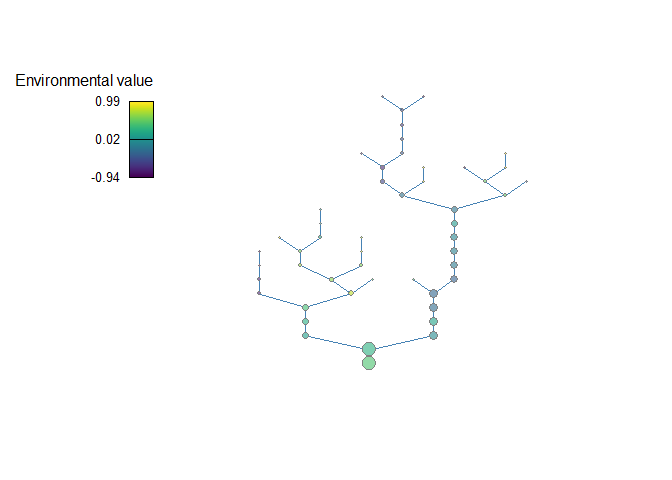

mcbrnet: An R package for simulating metacommunity dynamics in a
branching network
================
Akira Terui
9/10/2020

  - [Overview](#overview)
  - [Installation](#installation)
  - [Instruction](#instruction)
      - [`brnet()`: Basics](#brnet-basics)
      - [`brnet()`: Customization](#brnet-customization)
  - [References](#references)

# Overview

The package `mcbrnet` is composed of two functions: `brnet()` and
`mcsim()`.

  - `brnet`: Function `brnet()` generates a random branching network
    with the specified number of patches and probability of branching.
    The function returns adjacency and distance matrices, hypothetical
    environmental values at each patch, and the number of patches
    upstream (akin to watershed area in river networks). The output may
    be used in function `mcsim()` to simulate metacommunity dynamics in
    a branching network.

  - `mcsim`: Function `mcsim()` simulates metacommunity dynamics. By
    default, it produces a square-shaped landscape with randomly
    distributed habitat patches (x- and y-coordinates are drawn from a
    uniform distribution). If distance matrix is given, the function
    simulates metacommunity dynamics in the specified landscape.
    Function `mcsim()` follows a general framework proposed by Thompson
    et al. (2020). However, it has several unique features that are
    detailed in the following sections.

# Installation

The `mcbrnet` package can be installed with the following script:

``` r
#install.packages("remotes")
remotes::install_github("aterui/mcbrnet")
library(mcbrnet)
```

# Instruction

## `brnet()`: Basics

The function `brnet()` generates a random branching network. The key
arguments are the number of habitat patches (`n_patch`) and probability
of branching (`p_branch`), which the user must specify. The branching
network will be generated through the following steps:

1.  Determine the number of branches in the network. An individual
    branch is defined as a series of connected patches from one
    confluence (or outlet) to the next confluence upstream (or upstream
    terminal). The number of branches in a network `n_branch` is drawn
    from a binomial distribution as `n_branch = rbinom(n = 1, size =
    n_patch, prob = p_branch)`.

2.  Determine the number of patches in each branch. The number of
    patches in a branch `v_n_patch_branch` is drawn from a geometric
    distribution as `v_n_patch_branch = rgeom(n = n_branch, prob =
    p_branch) + 1`.

3.  Organize branches into a bifurcating branching network.

The following script produce a branching network with `n_patch = 50` and
`p_branch = 0.5` and returns adjacency and distance matrices. By
default, the function visualizes the generated network using functions
in package `igraph` (Csardi and Nepusz 2006):

``` r
net <- brnet(n_patch = 50, p_branch = 0.5)
```

<!-- -->

## `brnet()`: Customization

# References

  - Csardi G, Nepusz T: The igraph software package for complex network
    research, InterJournal, Complex Systems 1695. 2006.
    <http://igraph.org>
  - Thompson, P.L., Guzman, L.M., De Meester, L., Horváth, Z., Ptacnik,
    R., Vanschoenwinkel, B., Viana, D.S. and Chase, J.M. (2020), A
    process‐based metacommunity framework linking local and regional
    scale community ecology. Ecol Lett, 23: 1314-1329.
    <doi:10.1111/ele.13568>
