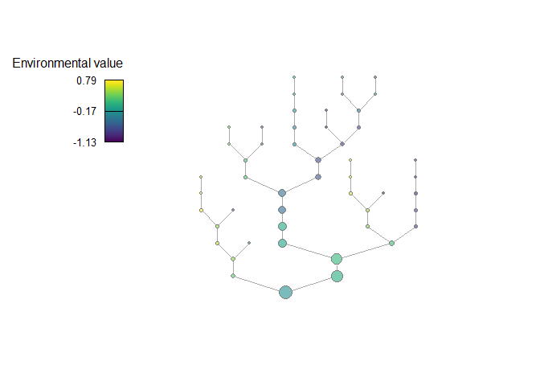
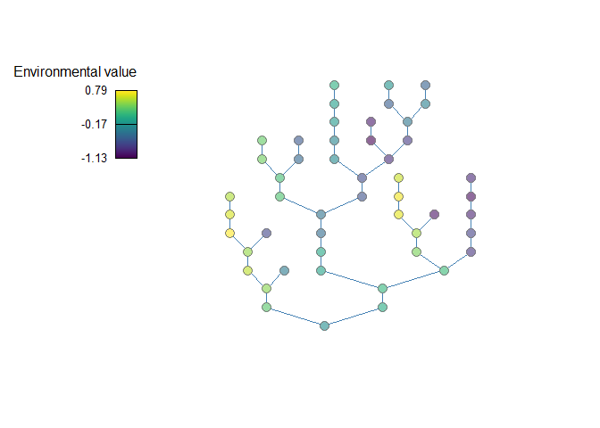
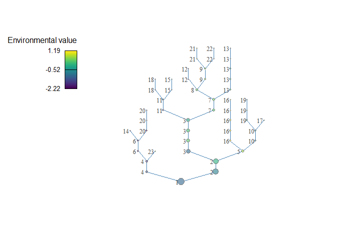
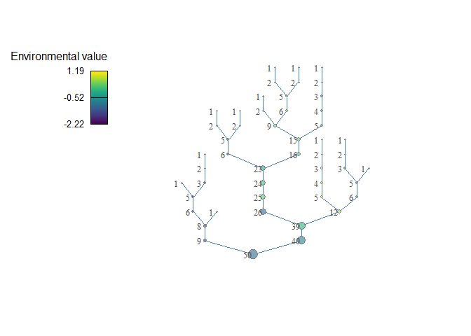
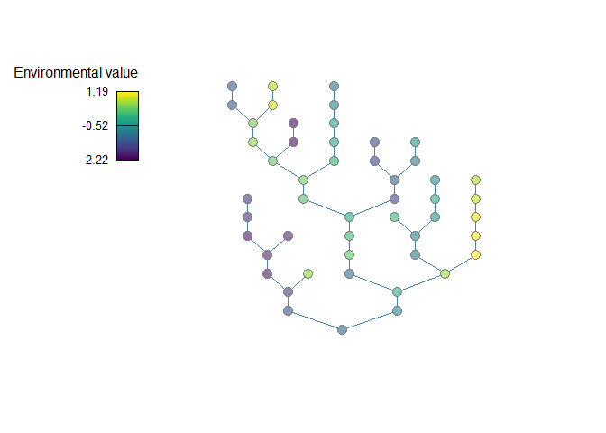
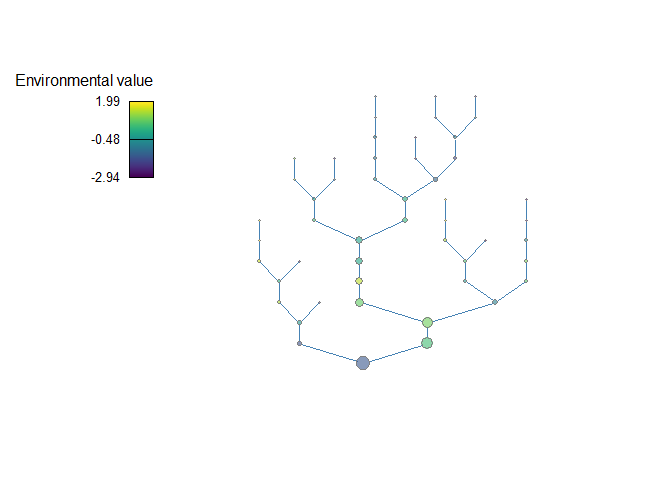
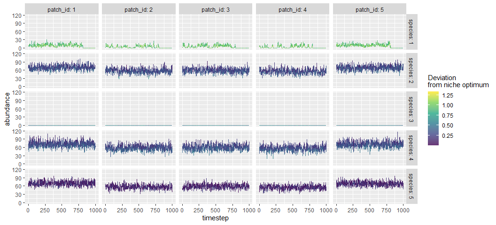
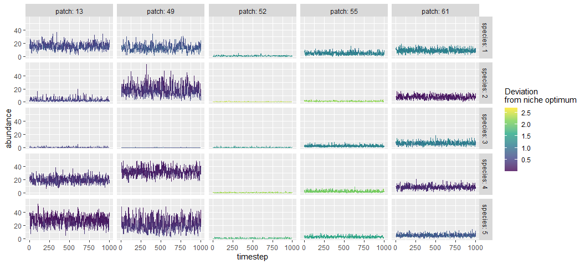

mcbrnet: an R package for simulating metacommunity dynamics in a
branching network
================
Akira Terui
September 16, 2020

  - [Overview](#overview)
  - [Installation](#installation)
  - [Instruction](#instruction)
      - [`brnet()`](#brnet)
          - [Basic usage](#basic-usage)
          - [Quick start](#quick-start)
          - [Custom setting:
            visualization](#custom-setting-visualization)
          - [Custom setting: environment](#custom-setting-environment)
      - [`mcsim()`](#mcsim)
          - [Basic usage](#basic-usage-1)
          - [Quick start](#quick-start-1)
          - [Custom setting: combine `brnet()` and
            `mcsim()`](#custom-setting-combine-brnet-and-mcsim)
          - [Custom setting: detailed
            parameters](#custom-setting-detailed-parameters)
          - [Model description](#model-description)
  - [References](#references)

# Overview

The package `mcbrnet` is composed of two functions: `brnet()` and
`mcsim()`.

  - `brnet`: Function `brnet()` generates a random branching network
    with the specified number of patches and probability of branching.
    The function returns adjacency and distance matrices, hypothetical
    environmental values at each patch, and the number of patches
    upstream (akin to the watershed area in river networks). The output
    may be used in function `mcsim()` to simulate metacommunity dynamics
    in a branching network.

  - `mcsim`: Function `mcsim()` simulates metacommunity dynamics. By
    default, it produces a square-shaped landscape with randomly
    distributed habitat patches (x- and y-coordinates are drawn from a
    uniform distribution). If a distance matrix is given, the function
    simulates metacommunity dynamics in the specified landscape.
    Function `mcsim()` follows a general framework proposed by Thompson
    et al. (2020). However, it has several unique features that are
    detailed in the following sections.

# Installation

The `mcbrnet` package can be installed with the following script:

``` r
#install.packages("remotes")
remotes::install_github("aterui/mcbrnet")
library(mcbrnet)
```

# Instruction

## `brnet()`

### Basic usage

The key arguments are the number of habitat patches (`n_patch`) and the
probability of branching (`p_branch`), which users must specify. With
these parameters, the function generates a branching network through the
following steps:

1.  Draw the number of branches in the network. An individual branch is
    defined as a series of connected patches from one confluence (or
    outlet) to the next confluence upstream (or upstream terminal). The
    number of branches in a network BR is drawn from a binomial
    distribution as BR \~ Binomial(N, P<sub>br</sub>), where N is the
    number of patches and P<sub>br</sub> is the branching probability.

2.  Draw the number of patches in each branch. The number of patches in
    each branch N<sub>br</sub> is drawn from a geometric distribution as
    N<sub>br</sub> \~ Ge(P<sub>br</sub>) but conditional on
    ΣN<sub>br</sub> = N.

3.  Organize branches into a bifurcating branching network.

Sample script:

``` r
net <- brnet(n_patch = 50, p_branch = 0.5)
```

The function returns:

  - `adjacency_matrix`: adjacency matrix.
  - `distance_matrix`: distance matrix. Distance between patches is
    measured as the number of patches required to reach from the focal
    patch to the target patch through the network.
  - `df_patch`: a data frame (`dplyr::tibble`) containing patch
    attributes.
      - *patch\_id*: patch ID.
      - *branch\_id*: branch ID.
      - *environment*: environmental value for each patch (see below for
        details)
      - *n\_patch\_upstream*: the number of upstream contributing
        patches (including the focal patch itself; akin to the watershed
        area in river networks).

### Quick start

The following script produce a branching network with `n_patch = 50` and
`p_branch = 0.5`. By default, `brnet()` visualizes the generated network
using functions in packages `igraph` (Csardi and Nepusz 2006) and
`plotfunctions` (van Rij 2020) (`plot = FALSE` to disable):

``` r
net <- brnet(n_patch = 50, p_branch = 0.5)
```

<!-- -->

Randomly generated environmental values color patches and patches’ size
is proportional to the number of patches upstream. To view matrices,
type the following script:

``` r
# adjacency matrix
# showing 10 patches for example
net$adjacency_matrix[1:10, 1:10]
```

    ##         patch1 patch2 patch3 patch4 patch5 patch6 patch7 patch8 patch9 patch10
    ## patch1       0      0      0      0      0      0      0      0      0       0
    ## patch2       0      0      1      0      0      0      0      0      0       0
    ## patch3       0      1      0      0      0      0      0      0      0       0
    ## patch4       0      0      0      0      1      0      0      0      0       0
    ## patch5       0      0      0      1      0      0      0      0      0       0
    ## patch6       0      0      0      0      0      0      1      0      0       0
    ## patch7       0      0      0      0      0      1      0      1      0       0
    ## patch8       0      0      0      0      0      0      1      0      1       0
    ## patch9       0      0      0      0      0      0      0      1      0       1
    ## patch10      0      0      0      0      0      0      0      0      1       0

``` r
# distance matrix
# showing 10 patches for example
net$distance_matrix[1:10, 1:10]
```

    ##         patch1 patch2 patch3 patch4 patch5 patch6 patch7 patch8 patch9 patch10
    ## patch1       0     10     11      4      5      3      4      5      6       7
    ## patch2      10      0      1     10     11      7      6      5      4       5
    ## patch3      11      1      0     11     12      8      7      6      5       6
    ## patch4       4     10     11      0      1      3      4      5      6       7
    ## patch5       5     11     12      1      0      4      5      6      7       8
    ## patch6       3      7      8      3      4      0      1      2      3       4
    ## patch7       4      6      7      4      5      1      0      1      2       3
    ## patch8       5      5      6      5      6      2      1      0      1       2
    ## patch9       6      4      5      6      7      3      2      1      0       1
    ## patch10      7      5      6      7      8      4      3      2      1       0

The following script lets you view branch ID, environmental values, and
the number of upstream contributing patches for each patch:

``` r
net$df_patch
```

    ## # A tibble: 50 x 4
    ##    patch_id branch_id environment n_patch_upstream
    ##       <int>     <dbl>       <dbl>            <dbl>
    ##  1        1         1      -0.481               50
    ##  2        2        12      -1.13                 2
    ##  3        3        12      -0.974                1
    ##  4        4        10       0.303                6
    ##  5        5        10       0.370                5
    ##  6        6         3      -0.431               26
    ##  7        7         3      -0.345               25
    ##  8        8         3      -0.595               24
    ##  9        9         3      -0.594               23
    ## 10       10        11      -0.180                6
    ## # ... with 40 more rows

### Custom setting: visualization

Arguments: `patch_label`, `patch_scaling`, `patch_size`

Users may add patch labels using the argument `patch_label`:

``` r
# patch ID
net <- brnet(n_patch = 50, p_branch = 0.5, patch_label = "patch")
```

<!-- -->

``` r
# branch ID
net <- brnet(n_patch = 50, p_branch = 0.5, patch_label = "branch")
```

<!-- -->

``` r
# number of upstream contributing patches
net <- brnet(n_patch = 50, p_branch = 0.5, patch_label = "n_upstream")
```

<!-- -->

To remove patch size variation, set `patch_scaling = FALSE` and specify
`patch_size`:

``` r
# number of upstream contributing patches
net <- brnet(n_patch = 50, p_branch = 0.5, patch_scaling = FALSE, patch_size = 8)
```

<!-- -->

### Custom setting: environment

Arguments: `min_env`, `max_env`, `rho`, `sd_env`

Some flexibility exists to simulate environmental values, which are
determined through an autoregressive process, as detailed below:

1.  Environmental values for upstream terminal patches (i.e., patches
    with no upstream patch) are drawn from a uniform distribution as
    z<sub>1</sub> \~ Uniform(min<sub>env</sub>, max<sub>env</sub>).

2.  Downstream environmental values are determined by an autoregressive
    process as z<sub>x</sub> = ρz<sub>x-1</sub> + ε<sub>x</sub> (‘x-1’
    means one patch upstream), where ε<sub>x</sub> \~ Normal(0,
    σ<sup>2</sup><sub>env</sub>). At bifurcation patches (or
    confluence), the environmental value takes a weighted mean of the
    two contributing patches given the size of these patches *s* (the
    number of upstream contributing patches): z<sub>x</sub> =
    ω(ρz<sub>1,x-1</sub> + ε<sub>1,x</sub>) + (1 -
    ω)(ρz<sub>2,x-1</sub> + ε<sub>2,x</sub>), where ω =
    s<sub>1</sub>/(s<sub>1</sub> + s<sub>2</sub>).

Users may change the values of `min_env` (default: min<sub>env</sub> =
-1), `max_env` (max<sub>env</sub> = 1), `rho` (ρ = 1), and `sd_env`
(σ<sub>env</sub> = 0.1). Increasing the range of `min_env` and
`max_env` leads to greater variation in environmental values at upstream
terminals. `rho` (0 ≤ ρ ≤ 1) determines the strength of longitudinal
autocorrelation (the greater the stronger autocorrelation). `sd_env`
(σ<sub>env</sub> \> 0) determines the strength of local environmental
noise. The following script produces a network with greater
environmental variation at upstream terminals (z<sub>1</sub> \~
Uniform(-3, 3)), weaker longitudinal autocorrelation (ρ = 0.5), and
stronger local noises (σ<sub>env</sub> = 0.5).

``` r
net <- brnet(n_patch = 50, p_branch = 0.5,
             min_env = -3, max_env = 3, rho = 0.5, sd_env = 0.5)
```

<!-- -->

## `mcsim()`

### Basic usage

The key arguments are the number of habitat patches (`n_patch`) and the
number of species in a metacommunity (`n_species`). The metacommunity
dynamics are simulated through (1) local dynamics (population growth and
competition among species), (2) immigration, and (3) emigration.

Sample script:

``` r
mc <- mcsim(n_patch = 5, n_species = 5)
```

The function returns:

  - `df_dynamics` a data frame containing simulated metacommunity
    dynamics\*.
      - *timestep*: time-step.
      - *patch*: patch ID.
      - *mean\_env*: mean environmental condition at each patch.
      - *env*: environmental condition at patch x and time-step t.
      - *carrying\_capacity*: carrying capacity at each patch.
      - *species*: species ID.
      - *niche\_optim*: optimal environmental value for species i.
      - *r\_xt*: reproductive number of species i at patch x and
        time-step t.
      - *abundance*: abundance of species i at patch x.
  - `df_species` a data frame containing species attributes.
      - *species*: species ID.
      - *mean\_abundance*: mean abundance (arithmetic) of species i
        across sites and time-steps.
      - *r0*: maximum reproductive number of species i.
      - *niche\_optim*: optimal environmental value for species i.
      - *p\_dispersal*: dispersal probability of species i.
  - `df_patch` a data frame containing patch attributes.
      - *patch*: patch ID.
      - *alpha\_div*: alpha diversity averaged across time-steps.
      - *mean\_env*: mean environmental condition at each patch.
      - *carrying\_capacity*: carrying capacity at each patch.
      - *connectivity*: structural connectivity at each patch. See below
        for details.
  - `df_diversity` a data frame containing diversity metrics (α, β, and
    γ).
  - `distance_matrix` a distance matrix used in the simulation.
  - `interaction_matrix` a species interaction matrix, in which species
    X (column) influences species Y (row).

\*NOTE: The warm-up and burn-in periods will not be included in return
values.

### Quick start

The following script simulates metacommunity dynamics with `n_patch = 5`
and `n_species = 5`. By default, `mcsim()` simulates metacommunity
dynamics with 200 warm-up (initialization with species introductions:
`n_warmup`), 200 burn-in (burn-in period with no species introductions:
`n_burnin`), and 1000 time-steps for records (`n_timestep`).

``` r
mc <- mcsim(n_patch = 5, n_species = 5)
```

Users can visualize the simulated dynamics using `plot = TRUE`, which
will show five sample patches and species that are randomly chosen:

``` r
mc <- mcsim(n_patch = 5, n_species = 5, plot = TRUE)
```

<!-- -->

A named list of return values:

``` r
mc
```

    ## $df_dynamics
    ## # A tibble: 25,000 x 9
    ##    timestep patch mean_env    env carrying_capaci~ species niche_optim  r_xt
    ##       <dbl> <dbl>    <dbl>  <dbl>            <dbl>   <dbl>       <dbl> <dbl>
    ##  1        1     1        0 0.0394              100       1     -0.298   3.78
    ##  2        1     1        0 0.0394              100       2     -0.138   3.94
    ##  3        1     1        0 0.0394              100       3     -0.764   2.90
    ##  4        1     1        0 0.0394              100       4     -0.122   3.95
    ##  5        1     1        0 0.0394              100       5     -0.0474  3.98
    ##  6        1     2        0 0.0829              100       1     -0.298   3.72
    ##  7        1     2        0 0.0829              100       2     -0.138   3.90
    ##  8        1     2        0 0.0829              100       3     -0.764   2.80
    ##  9        1     2        0 0.0829              100       4     -0.122   3.92
    ## 10        1     2        0 0.0829              100       5     -0.0474  3.97
    ## # ... with 24,990 more rows, and 1 more variable: abundance <dbl>
    ## 
    ## $df_species
    ## # A tibble: 5 x 6
    ##   species mean_abundance    r0 niche_optim niche_width p_dispersal
    ##     <dbl>          <dbl> <dbl>       <dbl>       <dbl>       <dbl>
    ## 1       1           93.1     4     -0.298            1         0.1
    ## 2       2           97.6     4     -0.138            1         0.1
    ## 3       3           65.3     4     -0.764            1         0.1
    ## 4       4           97.8     4     -0.122            1         0.1
    ## 5       5           98.3     4     -0.0474           1         0.1
    ## 
    ## $df_patch
    ## # A tibble: 5 x 5
    ##   patch alpha_div mean_env carrying_capacity connectivity
    ##   <dbl>     <dbl>    <dbl>             <dbl>        <dbl>
    ## 1     1         5        0               100       0.0185
    ## 2     2         5        0               100       1.07  
    ## 3     3         5        0               100       1.04  
    ## 4     4         5        0               100       0.114 
    ## 5     5         5        0               100       1.11  
    ## 
    ## $df_diversity
    ## # A tibble: 1 x 3
    ##   alpha_div beta_div gamma_div
    ##       <dbl>    <dbl>     <dbl>
    ## 1         5        0         5
    ## 
    ## $df_xy_coord
    ## # A tibble: 5 x 2
    ##   x_coord y_coord
    ##     <dbl>   <dbl>
    ## 1   7.36     7.42
    ## 2   2.85     4.39
    ## 3   2.77     5.13
    ## 4   0.688    2.39
    ## 5   3.31     4.79
    ## 
    ## $distance_matrix
    ##          patch1    patch2    patch3   patch4    patch5
    ## patch1 0.000000 5.4352670 5.1292848 8.353332 4.8294217
    ## patch2 5.435267 0.0000000 0.7475175 2.940507 0.6112653
    ## patch3 5.129285 0.7475175 0.0000000 3.438982 0.6388782
    ## patch4 8.353332 2.9405067 3.4389818 0.000000 3.5515759
    ## patch5 4.829422 0.6112653 0.6388782 3.551576 0.0000000
    ## 
    ## $interaction_matrix
    ##     sp1 sp2 sp3 sp4 sp5
    ## sp1   1   0   0   0   0
    ## sp2   0   1   0   0   0
    ## sp3   0   0   1   0   0
    ## sp4   0   0   0   1   0
    ## sp5   0   0   0   0   1

### Custom setting: combine `brnet()` and `mcsim()`

Return values of `brnet()` may be used to simulate metacommunity
dynamics in a branching network. For example, `df_patch$environment`,
`df_patch$n_patch_upstream`, and `distance_matrix` may be used to inform
parameters of `mcsim()`:

``` r
patch <- 100
net <- brnet(n_patch = patch, p_branch = 0.5, plot = F)
mc <- mcsim(n_patch = patch, n_species = 5,
            mean_env = net$df_patch$environment,
            carrying_capacity = net$df_patch$n_patch_upstream*10,
            distance_matrix = net$distance_matrix,
            plot = T)
```

<!-- -->

### Custom setting: detailed parameters

Users may use the following arguments to custom metacommunity
simulations regarding (1) species attributes, (2) competition, (3) patch
attributes, and (4) landscape structure.

#### Species attributes

Arguments: `r0`, `niche_optim` OR `optim_min` and `optim_max`,
`sd_niche_width`, `p_dispersal`

Species attributes are determined based on the maximum reproductive rate
`r0`, optimal environmental value `niche_optim` (or `optim_min` and
`optim_max` for random generation of `niche_optim`), niche width or
breadth `sd_nich_width` and dispersal probability `p_dispersal` (see
**Model description** for details).

For optimal environmental values (niche optimum), the function by
default assigns values randomly to each species as: μ<sub>i</sub> \~
Uniform(min<sub>μ</sub>, max<sub>μ</sub>), where users can set values of
min<sub>μ</sub> and max<sub>μ</sub> using `optim_min` and `optim_max`
arguments (default: `optim_min = -1` and `optim_max = 1`).
Alternatively, users may specify species niche optimums using the
argument `niche_optim` (scalar or vector). If `niche_optim` is a single
value, the function assumes that the niche optimums are the same for all
species. If `!is.null(niche_optim)`, then the function disables the
random generation process of niche optimums, ignoring `optim_min` and
`optim_max` arguments.

For other parameters, users may specify species attributes by giving a
scalar (assume identical among species) or a vector of values whose
length must be one or equal to `n_species`. Default values are `r0 = 4`,
`sd_niche_width = 1`, and `p_dispersal = 0.1`.

#### Competition

Arguments: `interaction_type`, `alpha` OR `min_alpha` and `max_alpha`

The argument `interaction_type` determines whether interaction
coefficient `alpha` is a constant or random variable. If
`interaction_type = "constant"`, then the interaction coefficients
α<sub>ij</sub> (i \!= j) for any pairs of species will be set as a
constant `alpha` (i.e., off-diagonal elements of the interaction
matrix). If `interaction_type = "random"`, α<sub>ij</sub> will be drawn
from a uniform distribution as α<sub>ij</sub> \~
Uniform(min<sub>α</sub>, max<sub>α</sub>), where users can specify
min<sub>α</sub> and max<sub>α</sub> using arguments `min_alpha` and
`max_alpha`. The argument `alpha` is ignored under the scenario of
random interaction strength (i.e., `interaction_type = "random"`). Note
that the diagonal elements of the interaction matrix (α<sub>ii</sub>)
are always 1.0 regardless of `interaction_type`, as `alpha` is the
strength of interspecific competition relative to that of intraspecific
competition (see **Model description**). By default, `interaction_type =
"constant"` and `alpha = 0`.

#### Patch attributes

Arguments: `carrying_capacity`, `mean_env`, `sd_env`,
`spatial_auto_cor`, `phi`

The arguments `carrying_capacity` (default: `carrying_capacity = 100`)
and `mean_env` (default: `mean_env = 0`) determines mean attributes of
habitat patches, which can be a scalar (assume identical among patches)
or a vector (length must be equal to `n_patch`).

The arguments `sd_env` (default: `sd_env = 0.1`), `spatial_auto_cor`
(default: `spatial_auto_cor = FALSE`) and `phi` (default: `phi = 1`)
determine spatio-temporal dynamics of environmental values. `sd_env`
determines the magnitude of temporal environmental fluctuations. If
`spatial_auto_cor = TRUE`, the function models spatial autocorrelation
of temporal environmental fluctuation based on a multi-variate normal
distribution. The degree of spatial autocorrelation would be determined
by `phi`, the parameter describing the strength of distance decay in
spatial autocorrelation (see **Model description**).

#### Landscape structure

Arguments: `xy_coord` OR `distance_matrix`, `landscape_size`, `theta`

These arguments define landscape structure. By default, the function
produces a square-shaped landscape (`landscape_size = 10` on a side) in
which habitat patches are distributed randomly through a Poisson point
process (i.e., x- and y-coordinates of patches are drawn from a uniform
distribution). The parameter θ describes the shape of distance decay in
species dispersal (see **Model description**) and determines patches’
structural connectivity (default: `theta = 1`). Users can define their
landscape by providing either `xy_coord` or `distance_matrix`
(`landscape_size` will be ignored if either of these arguments is
provided). If `xy_coord` is provided (2-column data frame denoting x-
and y-coordinates of patches, respectively; `NULL` by default), the
function calculates the distance between patches based on coordinates.
Alternatively, users may provide `distance_matrix` (the object must be
`matrix`), which describes the distance between habitat patches. The
argument `distance_matrix` overrides `xy_coord`.

#### Others

Arguments: `n_warmup`, `n_burnin`, `n_timestep`

The argument `n_warmup` is the period during which species introductions
occur (default: `n_warmup = 200`). The initial number of individuals
introduced follows a Poisson distribution with a mean of 0.5 and
independent across space and time. This random introduction events occur
multiple times over the `n_warmup` period, in which `propagule_interval`
determines the timestep interval of the random introductions (default:
`propagule_interval = ceiling(n_warmup / 10)`).

The argument `n_burnin` is the period that will be discarded as
*burn-in* to remove the influence of initial values (default: `n_burnin
= 200`). During the burn-in period, species introductions do not occur.

The argument `n_timestep` is the simulation peiord that is recorded in
the return `df_dynamics` (default: `n_timestep = 1000`). As a result,
with the default setting, the function simulates 1400 timesteps
(`n_warmup` + `n_burnin` + `n_timestep` = 1400) but returns only the
last 1000 timesteps as the resulting metacommunity dynamics. All the
derived statistics (e.g., diversity metrics in `df_diversity` and
`df_patch`) will be calculated based on the results during `n_timestep`.

### Model description

The metacommunity dynamics are described as a function of local
community dynamics and dispersal (Thompson et al. 2020). Specifically,
the realized number of individuals N<sub>ix</sub>(t + 1) (species i at
patch x and time t + 1) is given as:


where n<sub>ix</sub>(t) is the expected number of individuals given the
local community dynamics at time t, I<sub>ix</sub>(t) the expected
number of immigrants to patch x, and E<sub>ix</sub>(t) the expected
number of emigrants from patch x.

#### Local community dynamics

Local community dynamics are simulated based on the Beverton-Holt model:


where r<sub>ix</sub>(t) is the reproductive rate of species i given the
environmental condition at patch x and time t, r<sub>0,i</sub> the
maximum reproductive rate of species i (argument `r0`), K<sub>x</sub>
the carrying capacity at patch x (argument `carrying_capacity`), and
α<sub>ij</sub> the interaction coefficient with species j (argument
`alpha`). Note that α<sub>ij</sub> is the strength of interspecific
competition relative to that of intraspecific competition (intraspecific
competition is greater than interspecific competition if α<sub>ij</sub>
\< 1; α<sub>ii</sub> is set to be 1.0). The density-independent
reproductive rate r<sub>ix</sub>(t) is affected by environments and
determined by a Gaussian function:


where μ<sub>i</sub> is the optimal environmental value for species i
(argument `niche_optim`), z<sub>x</sub>(t) the environmental value at
patch x and time t, and σ<sub>niche</sub> the niche width of species i
(argument `sd_niche_width`). Environmental may vary spatially and
temporarily. The environmental value z<sub>x</sub>(t) is assumed to
follow a multivariate normal distribution:


**μ<sub>z</sub>** is the vector of mean environmental conditions of
patches (argument `mean_env`) and Ω<sub>z</sub> is the
variance-covariance matrix. If `spatial_auto_cor = FALSE`, the
off-diagonal elements of the matrix are set to be zero while diagonal
elements are σ<sub>z</sub><sup>2</sup> (σ<sub>z</sub>; argument
`sd_env`). If `spatial_auto_cor = TRUE`, spatial autocorrelation is
considered by describing the off-diagonal elements as:


where Ω<sub>xy</sub> denotes the temporal covariance of environmental
conditions between patch x and y, which is assumed to decay
exponentially with increasing distance between the patches. The
parameter φ (argument `phi`) determines distance decay (larger values
lead to sharper declines).

#### Dispersal

The expected number of emigrants at time t E<sub>ix</sub>(t) is the
product of dispersal probability P<sub>dispersal</sub> (argument
`p_dispersal`) and n<sub>ix</sub>(t). The immigration probability at
patch x, ξ<sub>ix</sub>, is calculated given the structural connectivity
of patch x, in which the model assumes the exponential decay of
successful immigration with the increasing separation distance between
habitat patches:


where d<sub>xy</sub> is the separation distance between patch x and y.
The parameter θ (argument `theta`) dictates the dispersal distance of
species (θ<sup>-1</sup> corresponds to the expected dispersal distance)
and is assumed to be constant across species. The expected number of
immigrants is calculated as:


# References

  - Csardi G, Nepusz T: The igraph software package for complex network
    research, InterJournal, Complex Systems 1695. 2006.
    <http://igraph.org>
  - Jacolien van Rij (2020). plotfunctions: Various Functions to
    Facilitate Visualization of Data and Analysis. R package version
    1.4. <https://CRAN.R-project.org/package=plotfunctions>
  - Thompson, P.L., Guzman, L.M., De Meester, L., Horváth, Z., Ptacnik,
    R., Vanschoenwinkel, B., Viana, D.S. and Chase, J.M. (2020), A
    process‐based metacommunity framework linking local and regional
    scale community ecology. Ecol Lett, 23: 1314-1329.
    <doi:10.1111/ele.13568>
